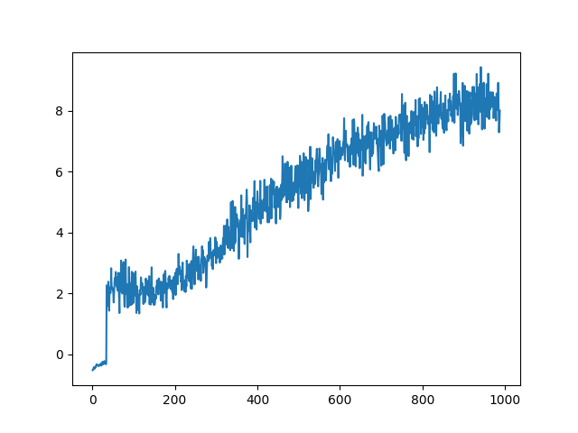

# Tetris Q-Learning Agent

This is a reinforcement learning agent that learns to play tetris. Feature engineering of this was very fun, and troubleshooting the code and watching run after run of the agent fail to learn anything was not as fun. 

In the end, after an extensive hyperparameter search and (light) abuse of server resources, the final run placed 2nd in Boston University's CS440's final project tournament, out of an enrollment of over 150.

Here's the learning curve. I can't express how excited I was to finally see the agent learn something after sorting through hundreds (ok dozens) of plots similar to this that just looked like flat noise.


## Details

- **Neural Network Architecture**
  - Initially, my NN was an order of magnitude too large!
  - 7 input features → 7 hidden nodes × 2 layers → 1 output (Q-value)
  - ReLU activation between layers
  - Trained using gradient descent with minibatches

- **Feature Engineering**
  - `totalHeight`: Sum of column heights (normalized by max 198)
  - `maxHeight`: Highest column (normalized by 22)
  - `bumpiness`: Sum of height differences between adjacent columns 
  - `holes`: Count of empty cells with filled cells above
  - `covers`: Number of blocks covering holes
  - `completeRows`: Number of full rows (normalized by 4)
  - `perfectClear`: Binary flag for completely clearing the board

- **Reward Function**
  - Quadratic bonus for multiple row clears
  - Large reward for perfect clears (6.0)
  - Severe penalty for game over (-999.0)
  - Small penalties for height (-0.00005), holes (-0.00036), etc.

- **Exploration Strategy** 
  - Dynamic exploration rate that decays with training progress
  - $P(\text{explore}) = (\frac{n_{phases} - i_{current}}{n_{phases}})^5 + 0.04$
  - During exploration, chooses moves based on immediate reward calculation
  - Small random perturbation added to prevent ties

## Training

- Used minibatch training between game phases
- Gamma: 0.99 
- Learning rate: 0.001
- Buffer size: 50,000 games
- Trained for 5,000 phases with 100-400 games per phase

## Usage

```bash
# Train a new agent
java -cp "lib/*:." edu.bu.tetris.Main -q src.pas.tetris.agents.TetrisQAgent \
  -p 5000 -t 400 -v 100 -g 0.99 -n 0.001 -b 50000 \
  -o ./8-2-3-params/q -s | tee 8-2-3.log

# Run a trained model
java -cp "lib/*:." edu.bu.tetris.Main \
  -q src.pas.tetris.agents.TetrisQAgent -i /path/to/model.model
```

## Acknowledgements

Huge thanks to Dr. Andrew Wood for engineering much of the complexities of the Tetris engine and providing guidance.